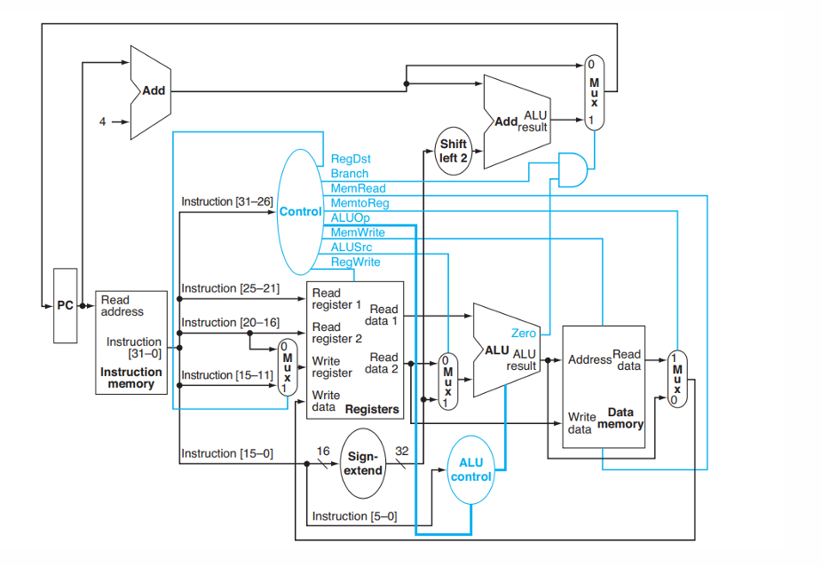

# RISC-V Sequential Processor (RV64I)

A non-pipelined, single-cycle RISC-V processor implemented in Verilog, based on the RV64I instruction set architecture.

## Table of Contents

- [Overview](#overview)
- [Datapath Architecture](#datapath-architecture)
- [Supported Instructions](#supported-instructions)
- [Module Descriptions](#module-descriptions)
- [Project Structure](#project-structure)
- [Getting Started](#getting-started)
- [Testing & Results](#testing--results)
- [Conclusion](#conclusion)

---

## Overview

This project presents the design and implementation of a **sequential (non-pipelined) RISC-V processor** based on the RV64I instruction set. The processor is implemented in **Verilog** and simulated using **iVerilog**.

Key characteristics:
- Executes **one instruction at a time** in a single instruction cycle
- No pipelining or hazard handling required
- Fully modular design — each datapath component is an independent Verilog module
- All modules operate **synchronously** with the clock signal

---

## Datapath Architecture

The complete datapath of the sequential processor is shown below:


<p align="center">
  
</p>

The datapath follows the standard single-cycle RISC-V design with the following data flow:

1. **Fetch** — PC provides the address; Instruction Memory returns the 32-bit instruction
2. **Decode** — Control Unit decodes the opcode; Register File reads source operands
3. **Execute** — ALU performs the required operation using operands and/or immediate values
4. **Memory Access** — Data Memory performs load or store if required
5. **Write-Back** — Result is written back to the destination register

---

## Supported Instructions

| Format | Instructions |
|--------|-------------|
| R-type | `add`, `sub`, `and`, `or` |
| I-type | `addi` |
| Load   | `ld` |
| Store  | `sd` |
| Branch | `beq` |

---

## Module Descriptions

The processor is built from the following independently designed and verified modules:

### 1. Program Counter (`pc.v`)
- 64-bit register storing the address of the current instruction
- Updates on every rising clock edge
- Resets to `0x0000...0000` when the reset signal is asserted

### 2. Register File (`register_file.v`)
- 32 × 64-bit general-purpose registers (RV64I architecture)
- 2 combinational read ports, 1 synchronous write port
- Register `x0` is hardwired to zero and cannot be written

### 3. Instruction Memory (`Instruction_Memory.v`)
- Read-only memory, 4096 bytes, byte-addressed
- Loads instructions from `instructions.txt` at initialization
- Outputs a 32-bit instruction in **Big-Endian** format

### 4. Control Unit (`control.v`)
- Decodes the 7-bit opcode and generates all datapath control signals
- Combinational logic — outputs update immediately on opcode change

| Instruction | ALUSrc | MemToReg | RegWrite | MemRead | MemWrite | Branch | ALUOp |
|-------------|--------|----------|----------|---------|----------|--------|-------|
| R-format    | 0      | 0        | 1        | 0       | 0        | 0      | 10    |
| `ld`        | 1      | 1        | 1        | 1       | 0        | 0      | 00    |
| `sd`        | 1      | X        | 0        | 0       | 1        | 0      | 00    |
| `beq`       | 0      | X        | 0        | 0       | 0        | 1      | 01    |

### 5. Immediate Generator (`Immediate_Generation.v`)
- Extracts and **sign-extends** immediate fields to 64 bits
- Supports I-type, load, S-type, and B-type instruction formats

### 6. ALU Control (`alu_control.v`)
- Generates a 4-bit control signal for the ALU based on `ALUOp` and `funct3`/`funct7` fields

| ALUOp | Operation | ALU Control |
|-------|-----------|-------------|
| 00    | ADD (for `ld`/`sd`) | 0010 |
| 01    | SUB (for `beq`)     | 0110 |
| 10    | R-type (`add`/`sub`/`and`/`or`) | see funct bits |

### 7. 64-bit ALU (`alu.v`)
- Performs ADD, SUB, AND, OR on 64-bit operands
- Outputs a **zero flag** used for branch decisions
- Uses dedicated 64-bit submodules for each operation

### 8. Data Memory (`Data_Memory.v`)
- 1024 bytes of byte-addressable storage
- Supports 64-bit load (`ld`) and store (`sd`) operations in **Big-Endian** format
- Synchronous writes on rising clock edge; combinational reads

### 9. 2:1 Multiplexer (`mux2_1.v`)
- Selects between two 64-bit inputs based on a single control signal
- Used for ALU source selection, PC source selection, and write-back data selection

### 10. 64-bit Adder (`adder64.v`)
- Combinational adder used for PC+4 increment and branch target computation

### 11. Shift Left by 1 (`sl1.v`)
- Performs a logical left shift by 1 bit on the 64-bit immediate value
- Used to align branch offsets to instruction boundaries (multiplies offset by 2)

---

## Project Structure

```
risc-v-sequential-processor/
│
├── src/                        # Verilog source files
│   ├── pc.v                    # Program Counter
│   ├── register_file.v         # Register File
│   ├── Instruction_Memory.v    # Instruction Memory
│   ├── control.v               # Control Unit
│   ├── Immediate_Generation.v  # Immediate Generator
│   ├── alu_control.v           # ALU Control
│   ├── alu.v                   # 64-bit ALU
│   ├── Data_Memory.v           # Data Memory
│   ├── mux2_1.v                # 2:1 Multiplexer
│   ├── adder64.v               # 64-bit Adder
│   ├── sl1.v                   # Shift Left by 1
│   └── seq.v                   # Top-Level Sequential Processor
│
├── tb/                         # Testbench files
│   ├── pc_tb.v
│   ├── register_file_tb.v
│   ├── Instruction_Memory_tb.v
│   ├── control_tb.v
│   ├── Immediate_Generation_tb.v
│   ├── alu_control_tb.v
│   ├── alu_64_bit_tb.v
│   ├── Data_Memory_tb.v
│   ├── mux2_1_tb.v
│   ├── adder64_tb.v
│   ├── sl1_tb.v
│   └── seq_tb.v
│
├── instructions.txt            # Hex-encoded program instructions
├── docs/
│   └── IPA_Sequential_Project_Report.pdf
└── README.md
```

---


## Testing & Results

### Basic Functionality Test

A basic test program covering all supported instruction types was executed. The assembly program performed arithmetic, logical, load/store, and branch operations.

**Register File Output (after execution):**

```
x1  = 000000000000000f   (15)
x2  = fffffffffffffffb   (-5)
x3  = 000000000000000a   (10)
x4  = 000000000000000a   (10)
x5  = 000000000000000a   (10)
x6  = fffffffffffffffb   (-5)
x7  = fffffffffffffffb   (-5)
x10 = 000000000000000f   (15)
x11 = fffffffffffffffb   (-5)
x13 = 000000000000001e   (30)

Total instructions executed: 15
```

---

### Fibonacci Sequence Test

The processor was validated by computing the **10th Fibonacci number** using a loop and branch instructions.

**Assembly Program:**

```asm
addi x1, x0, 10      # Initialize loop counter n = 10
addi x2, x0, 0       # a = 0
addi x3, x0, 1       # b = 1
addi x1, x1, -1      # n = n - 1
beq  x1, x0, 20      # If n == 0, exit loop
add  x4, x2, x3      # temp = a + b
addi x2, x3, 0       # a = b
addi x3, x4, 0       # b = temp
beq  x0, x0, -20     # Unconditional branch back to loop
```

**Register File Output (after execution):**

```
x0  = 0000000000000000   (0)
x1  = 0000000000000000   (0)   ← loop counter exhausted
x2  = 0000000000000022   (34)  ← 9th Fibonacci number
x3  = 0000000000000037   (55)  ← 10th Fibonacci number
x4  = 0000000000000037   (55)  ← last computed value

Total instructions executed: 60
```

The result confirms correct execution: 6 instructions per iteration × 10 iterations = **60 total instructions**.

---

## Conclusion

A sequential, non-pipelined RISC-V processor (RV64I) was successfully designed, implemented in Verilog, and verified through simulation. All datapath modules were developed independently, tested with dedicated testbenches, and integrated into a complete working processor. The design correctly executes arithmetic, logical, memory, and branch instructions, as validated by both the basic test and the Fibonacci benchmark.

---
